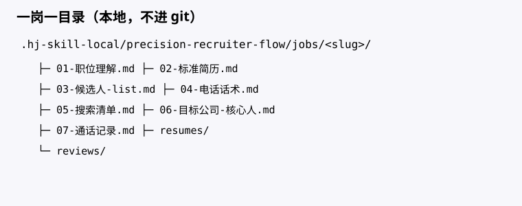
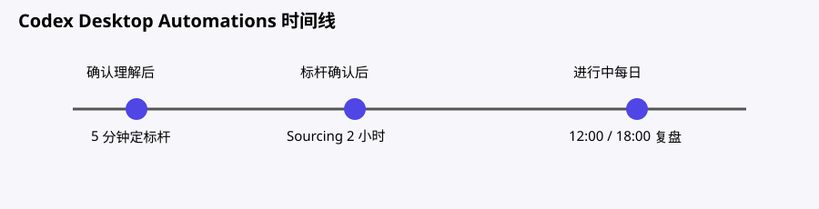

# 精准猎头流

适用于 Codex 桌面版的单岗位猎头工作流：先理解职位，再在 5 分钟内定标杆，随后用 2 小时定向 sourcing，人工电话跟进，并在每天 12:00、18:00 复盘。触发语包括「新岗位」「开一个单」「用精准猎头流」，或直接粘贴 JD 要求按猎头流程推进。

## 安装

### macOS（Codex 桌面版）

默认安装路径为 `~/.codex/skills/precision-recruiter-flow`，展开后是 `/Users/<用户名>/.codex/skills/precision-recruiter-flow`。在 zsh 中运行：

```bash
mkdir -p ~/.codex/skills
git clone https://github.com/HanjingLaura/precision-recruiter-flow.git ~/.codex/skills/precision-recruiter-flow
```

如果已经安装过，使用下面的命令更新：

```bash
git -C ~/.codex/skills/precision-recruiter-flow pull
```

卸载时删除安装目录：

```bash
rm -rf ~/.codex/skills/precision-recruiter-flow
```

本 skill 面向 **Codex 桌面版（macOS）**；Automations 在桌面版里创建。岗位数据仍保存在工作区的 `.precision-recruiter-local/jobs/<slug>/`，与平台无关，Mac 同样如此。

删除 skill 安装目录不会删除工作区中的岗位资料；资料位于每个工作区的 `.precision-recruiter-local/jobs/`。

在 Finder 中按 `Command-Shift-G`（前往文件夹），输入 `~/.codex/skills` 并回车即可打开安装目录；也可以在 Terminal 执行 `open ~/.codex/skills`。`.codex` 是隐藏目录，但“前往文件夹”仍可直接访问。

### Windows

可将仓库克隆到 `C:\Users\<用户名>\.codex\skills\precision-recruiter-flow`。更新已安装版本时，在该目录执行 `git pull`。安装后在 Codex 桌面版输入 `使用 $precision-recruiter-flow 开一个新岗位`。

### 通用

安装后重启或重新打开 Codex 桌面版，让它重新加载 skill。无论平台如何，岗位数据都写入当前工作区的 `.precision-recruiter-local/jobs/<slug>/`，不会提交到 git。

### macOS 常见问题

- **Skill 没有出现**：确认仓库位于 `~/.codex/skills/precision-recruiter-flow` 且目录内有 `SKILL.md`；运行更新命令后完全退出并重新打开 Codex 桌面版，并确认打开的是包含 `.precision-recruiter-local/` 的目标工作区。
- **权限或无法写入**：确认当前用户对 `~/.codex` 和目标工作区有读写权限；Finder 中选中文件夹后按 `Command-I` 查看“共享与权限”。不要用 `sudo` 安装，以免目录属于其他用户。
- **路径中有空格**：将路径放在引号中，例如 `git -C "$HOME/My Work/.codex/skills/precision-recruiter-flow" pull`；使用 `~` 或 `$HOME` 可避免手写用户名和空格转义。
- **Mac 上有多个用户名**：每个 macOS 用户都有独立的 `/Users/<用户名>/.codex/skills`。请用实际登录用户安装，并在同一用户的 Codex 桌面版中打开。

## 文件说明

- `SKILL.md`：触发条件、流程、状态机、硬规则和 Automation 协议。
- `agents/openai.yaml`：桌面版显示名、简介和默认提示词。
- `references/templates/`：开岗时复制的 7 个岗位文件及复盘模板。
- `references/images/`：目录树、状态机、Automation 时间线示意图。
- `.precision-recruiter-local/jobs/<slug>/`：工作区私有岗位数据；简历、通话和复盘不提交 git。






## 完整用法

1. 说“新岗位：……”，skill 创建 `.precision-recruiter-local/jobs/<slug>/`，复制模板。
2. 共同整理 JD，写入 `01-职位理解.md`；你确认“理解 OK”后才进入下一步。
3. Codex 桌面版自行创建一次「5 分钟定标杆」Automation：读取 01 和 leader 样板、自搜高匹配、客户面到 offer、在岗画像，写出 `02-标准简历.md`。
4. 你确认标杆后，创建「Sourcing 2 小时」Automation：按公司、业务线、级别、地点、薪资拆搜索，目标约 10 个准人，更新 `05-搜索清单.md`、`03-候选人-list.md` 和 `resumes/`。禁止过宽搜；不自动外呼、不自动推客户。
5. 使用 `04-电话话术.md` 人工打电话，每次把时间、候选人、结果、要点纪要、下次动作写入 `07-通话记录.md`，再更新 03 的状态、通话次数和最近触达日。
6. 岗位进行中创建每日 12:00、18:00 的复盘 Automation，生成 `reviews/YYYY-MM-DD-HH-复盘.md`。复盘检查准人进度、呼出、是否搜超时、标杆/职位理解是否回写，并给出下一步 1–2 条。

`06-目标公司-核心人.md` 是公司地图（在岗对标人、上级/协作、同方向未触达、行业标杆、可选离职不久），含“是否已转入 list”；开始打后转入 03。03 只放本单已决定建联、在打或在推的人。人工肉眼搜建议 ≤4h/日，日有效呼出参考 20–30。

如果桌面版不能由 skill 直接创建 Automation，skill 会输出可复制的触发、prompt、读写文件配置，仍由你在 Automations 面板创建。

### macOS Automations 核对

打开 Codex 桌面版的 **Automations** 面板，进入当前工作区，逐项核对触发时间、工作区、prompt 以及读写文件：

1. **5 分钟定标杆**：确认职位理解后创建一次性 Automation，读取 `01-职位理解.md` 和 leader 样板，输出 `02-标准简历.md`。
2. **Sourcing 2 小时**：确认标杆后创建定向 sourcing Automation，运行窗口为 2 小时；更新 `05-搜索清单.md`、`03-候选人-list.md` 和 `resumes/`，不自动外呼或推客户。
3. **12:00、18:00 复盘**：岗位进行中创建每天两个复盘 Automation，检查准人进度、呼出、搜超时以及标杆和职位理解回写，并生成 `reviews/YYYY-MM-DD-HH-复盘.md`。

如果界面没有自动创建按钮，复制 skill 输出的触发、prompt 和读写文件配置，在 Automations 面板手动新建。
